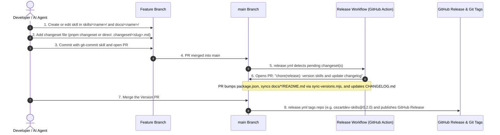

# Agent Operating Guidelines & Standards

This document establishes the mandatory operating standards, execution workflow, and rules of engagement for all AI agents working on `skills`.

---

## 1. Agent Operational Rules & Tooling

- **Repository & JS/TS Package Manager**: Use `pnpm` exclusively for all JavaScript/TypeScript package management commands, script executions, and root repository configuration.
- **Python Environment & Package Manager**: Use `uv` exclusively for Python virtual environments, dependency management (`uv pip`, `uv add`, `uv run`), and script execution.
- **Documentation & APIs**: Always use `context7` tools when looking up library documentation or modern API syntax.
- **Default Language**: All code, docstrings, git commit messages, READMEs, skill descriptions, and technical documentation MUST be written in English.

---

## 2. Git Commit Standards & Examples

All git commit messages MUST adhere to the **Conventional Commits** specification and MUST be written in English.

### Format
```text
<type>(<scope>): <short description in present tense>

[optional body giving contextual reasoning]
```

### Commit Types
- `feat`: A new feature or skill functionality.
- `fix`: A bug fix in a script, skill, or configuration.
- `docs`: Documentation updates (e.g., `AGENTS.md`, `README.md`, skill documentation).
- `refactor`: Code restructuring without changing functionality.
- `chore`: Maintenance tasks, updating dependencies (`package.json`, `pyproject.toml`), config files.
- `test`: Adding or updating tests.

### Commit Rules
1. Use imperative present tense ("add", "update", "fix", not "added", "updated", "fixes").
2. Keep the first line under 120 characters.
3. No period `.` at the end of the subject line.
4. Scope should indicate the specific skill or subsystem (e.g., `workflow`, `commits`, `agents`, `deps`).

### Examples of Valid Commits

```bash
# Adding a new skill feature
git commit -m "feat(workflow): implement langgraph state graph runner for deterministic steps"

# Documenting agent guidelines
git commit -m "docs(agents): define git commit conventions and python dependency rules"

# Fixing a script bug in a skill
git commit -m "fix(commits): handle empty staged diffs gracefully in commit generator"

# Updating dependencies
git commit -m "chore(deps): add langgraph and langchain-core via uv"

# Refactoring skill scripts
git commit -m "refactor(workflow): decouple state serialization from graph execution"
```

---

## 3. Skill Architecture & Standards

Skills created in this repository must follow a clean, modular structure compatible with standard AI agent skill interfaces (e.g., `skills.sh` / Agent Skills specification).

### Skill Directory Layout
Each skill resides under `skills/<skill-name>/`. Only `SKILL.md` is mandatory; all other files and subdirectories are optional and should only be added when strictly needed:

```text
skills/<skill-name>/
├── SKILL.md              # [REQUIRED] Skill specification & instructions (YAML frontmatter + markdown)
├── pyproject.toml        # [OPTIONAL] Python dependencies managed via uv (if skill uses Python packages)
├── package.json          # [OPTIONAL] Node.js dependencies managed via pnpm (if skill uses Node packages)
├── scripts/              # [OPTIONAL] Helper scripts (Python or Node) for automation/execution
├── references/           # [OPTIONAL] Additional reference docs read on-demand by agents
└── resources/            # [OPTIONAL] Static templates, assets, or schemas
```

### Skill Guidelines
- **Self-Contained & Minimalist**: Every skill must have a valid `SKILL.md` with frontmatter (`name`, `description`). Avoid creating empty folders (`resources/`, `references/`, `scripts/`) unless they are actively utilized.
- **Documentation Standards**: Every skill created MUST have a corresponding documentation file in `docs/<skill-name>/README.md` containing:
  - Skill metadata (Author: `cezartdev`, Version, Status).
  - Purpose, feature list, and prerequisites.
  - Usage instructions for agents and human developers.
  - Complete CLI command reference and example workflows.
  - `skills-cli` installation commands (specifying `npx skills add cezartdev/skills --skill <skill-name>` and noting the mandatory `--skill` flag to prevent git branch confusion).
- **Dependencies**: If a skill uses Python scripts with external libraries, manage them via `uv` within the skill directory or workspace environment. If using Node.js scripts, use `pnpm`.
- **Interoperability**: Structure `SKILL.md` so it is fully compatible with standard AI agent skill interfaces (e.g., `skills.sh`, Antigravity, Claude Desktop, Cursor, etc.).

---

## 4. Versioning, Changesets & Release Standards

The repository uses **Changesets** (`@changesets/cli` and `@changesets/changelog-github`) alongside GitHub Actions for automated semantic versioning, `CHANGELOG.md` generation, documentation synchronization, and GitHub release tagging.

### Key Versioning Principles
- **Private Repository Package**: The root `package.json` is marked `"private": true`. Instead of publishing to npm, Changesets is configured (`.changeset/config.json` with `privatePackages: { version: true, tag: true }`) to generate Git Tags (e.g., `v0.2.0`) and official GitHub Releases with formatted changelogs.
- **Single Source of Truth**: `package.json` contains the primary version number. `scripts/sync-versions.mjs` automatically propagates this version to all skill documentation files (`docs/*/README.md`) and plugin manifests.
- **Deterministic Releases**: Commits alone do NOT trigger version bumps. A version bump ONLY occurs when one or more Changeset files exist on `main`.

### SemVer Bump Guide (When to choose which type)

| Bump Type | Target Version | Trigger / Scenario | Examples |
|---|---|---|---|
| **`patch`** | `0.1.0` $\rightarrow$ `0.1.1` | Bug fixes, script corrections, minor documentation adjustments, dependency patches. | Fixing regex in `commit_helper.py`, correcting a typo in `SKILL.md`. |
| **`minor`** | `0.1.0` $\rightarrow$ `0.2.0` | Adding a **new skill**, introducing new tools/features to an existing skill without breaking changes. | Adding `skills/workflow/`, adding a new command to an existing skill. |
| **`major`** | `0.1.0` $\rightarrow$ `1.0.0` | Breaking changes, complete redesign of core skill interfaces or execution models. | Redesigning `SKILL.md` format incompatibility, breaking CLI arguments. |

---

### Step-by-Step Developer & Agent Workflow



#### Step 1: Implement Skill & Update Documentation
Create your skill under `skills/<skill-name>/` and corresponding docs under `docs/<skill-name>/README.md`.

#### Step 2: Declare the Changeset

##### Option A: Interactive CLI (Human developers)
```bash
pnpm changeset
```
Follow interactive prompts to select bump type (`patch`, `minor`, `major`) and enter summary in English.

##### Option B: Programmatic Declaration (AI Agents / Automated scripts)
Agents running in headless environments should directly generate a `.changeset/<unique-slug>.md` file with the following format:

```markdown
---
"cezartdev-skills": minor
---

Add deterministic workflow skill with LangGraph state machine runner.
```

*(Note: Replace `minor` with `patch` or `major` and write the summary in English)*.

#### Step 3: Pre-Flight Validation & Commit
Use the `git-commit` helper script to validate and execute the commit:
```bash
python3 skills/git-commit/scripts/commit_helper.py commit \
  -t feat \
  -s workflow \
  -m "implement deterministic state machine runner" \
  -b "add LangGraph execution engine for structured multi-step tasks"
```

#### Step 4: Verify Version Synchronization
To verify that all documentation files match the package version:
```bash
pnpm check-version
```

#### Step 5: Merge & Automated Release
Once the feature PR merges into `main`, GitHub Actions (`.github/workflows/release.yml`):
1. Collects all pending changesets.
2. Creates/updates a single `"chore(release): version skills and update changelog"` PR.
3. Automatically runs `pnpm version` (`changeset version && node scripts/sync-versions.mjs`).
4. Upon merging the Release PR, creates the Git Tag and GitHub Release.

---

## 5. Planned Skills Roadmap

1. **`workflow` (Deterministic Agent Workflow)**:
   - **Engine**: Python + LangGraph.
   - **Purpose**: Provides a deterministic, state-machine driven workflow runner for multi-step tasks across any repository. Ensures agent execution state is logged, verifiable, and strictly bound to step transitions.
2. **`git-commit` (Automated Standardized Commits)**:
   - **Engine**: Node.js / Python CLI helper.
   - **Purpose**: Analyzes git status and staged diffs to draft, validate, and execute Conventional Commit messages following repository standards automatically.


