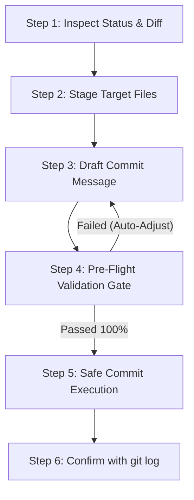

# Git Commit Skill (`git-commit`)

This skill provides an automated, deterministic workflow for creating standardized **Conventional Commits** in English. It enforces strict type whitelisting, length bounds, imperative English verb checks, and pre-flight validation before executing any commit.

---

## 1. Commit Format Standards

Every commit generated or validated by this skill MUST strictly follow this structure:

```text
<type>(<scope>): <imperative_verb> <description>

- <concise bullet point explaining rationale or context>
- <concise bullet point explaining impact>
```

### Strict Rules:

1. **Type Whitelist (Strictly 6 Types)**:
   - `feat`: A new feature, skill, or functional enhancement.
   - `fix`: A bug fix or correction.
   - `docs`: Documentation only (e.g., `README.md`, `AGENTS.md`, `SKILL.md`).
   - `refactor`: Restructuring code/scripts without changing functionality.
   - `chore`: Dependency updates (`package.json`, `pyproject.toml`), configs, build tasks.
   - `test`: Adding, updating, or fixing tests.
   *Any other type is strictly rejected.*

2. **Scope**:
   - Lowercase alphanumeric or kebab-case (e.g., `workflow`, `git-commit`, `agents`, `deps`, `auth`).
   - No spaces or uppercase characters.

3. **Description**:
   - **Language**: Strictly **English**.
   - **Imperative Present Tense**: Must begin with a lowercase English action verb (e.g., `add`, `update`, `fix`, `implement`, `refactor`, `remove`, `configure`, `create`, `ensure`, `handle`, `enforce`, `resolve`, `support`, `document`).
   - **Casing & Spacing**: Lowercase sentence, single spaces only. No accidental `snake_case` in general prose.
   - **No Trailing Period**: Never end the subject line with a period (`.`).
   - **Length Limits**:
     - Description length: **$\ge 10$ characters**.
     - Full header line: **$\le 120$ characters**.

4. **Body (Optional)**:
   - When additional context is needed, format lines as concise bullet points (`- ...`).
   - Each bullet point must be in English and under 120 characters.

---

## 2. Step-by-Step Execution Workflow

Follow this sequence to inspect, draft, validate, and execute commits:



### Step 1: Inspect Changes & Check for Clean Tree
Run git commands to understand what changed:
```bash
git status -s
git diff
```

> [!IMPORTANT]
> **No-Changes Protocol**: If `git status -s` produces no output (working tree is clean), there are no changes to commit. 
> The agent MUST NOT attempt to run `git commit` or validate empty strings. Instead, terminate the task early and report:
> `"No changes detected in working tree. No commit was executed."`

### Step 2: Stage Target Files
Stage only intentional changes (avoid staging unrelated temporary files):
```bash
git add <path/to/file1> <path/to/file2>
```

### Step 3: Draft Candidate Message
Formulate the message adhering to the whitelisted types, scope, and English imperative verb.

### Step 4: Run Pre-Flight Validation Gate
Validate the message using the helper script before committing:
```bash
python skills/git-commit/scripts/commit_helper.py validate "<proposed_commit_message>"
```

If validation fails, read the failing step in the report and adjust the message until all steps pass.

### Step 5: Execute Safe Commit
Run the atomic commit command through the helper or standard git:
```bash
python skills/git-commit/scripts/commit_helper.py commit -t <type> -s <scope> -m "<description>" [-b "<bullet1>"] [-b "<bullet2>"]
```
*Or directly via git once validated:*
```bash
git commit -m "<validated_header>" [-m "- <bullet1>"]
```

### Step 6: Verify Commit
Confirm the commit was recorded cleanly:
```bash
git log -1 --stat
```

---

## 3. Pre-Flight Validation Functions

The validation pipeline runs 8 modular checks:

| # | Function | Rule Enforced |
|---|---|---|
| 1 | `validate_structure` | Matches `<type>(<scope>): <description>` structure |
| 2 | `validate_type` | Type is one of: `feat`, `fix`, `docs`, `refactor`, `chore`, `test` |
| 3 | `validate_scope` | Scope is lowercase kebab-case / alphanumeric |
| 4 | `validate_header_length` | Total header length is $\le 120$ characters |
| 5 | `validate_description_length` | Description part is $\ge 10$ characters |
| 6 | `validate_no_trailing_period` | Header does not end with `.` |
| 7 | `validate_english_imperative_verb`| First word is an approved English imperative verb |
| 8 | `validate_casing_and_spacing` | Lowercase start, clean single spaces, no snake_case prose |

---

## 4. Examples

### ✅ Valid Examples
```bash
# Feature addition
feat(git-commit): implement modular step validation pipeline

# Documentation update
docs(agents): update commit conventions and add length limits

# Bug fix with bullet body
fix(git-commit): handle empty diff output in commit helper

- check for empty git status before attempting to parse files
- return friendly error message when working tree is clean

# Dependency update
chore(deps): update pnpm packages to latest patch versions
```

### ❌ Invalid Examples & Why They Fail
| Invalid Message | Why it Fails |
|---|---|
| `git-commit: add helper` | Missing type and parenthesis around scope |
| `feat(git-commit): añadido validador` | Non-English description & verb |
| `feat(git-commit): added helper.` | Past tense verb (`added`) and trailing period (`.`) |
| `feat(git-commit): fix` | Description is under 10 characters |
| `custom(workflow): create state graph` | `custom` is not in the strict type whitelist |
| `feat(git-commit): add_helper_script` | Uses snake_case in description instead of standard English prose |
