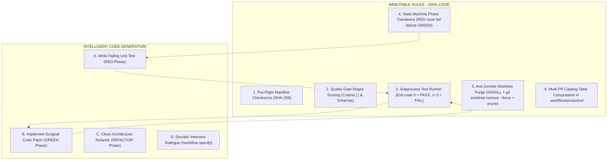

# Technical Architecture & Reference Guide: `workflow`

This document serves as an in-depth reference for the internal architecture, state machine, `.workflow/` module encapsulation, Multi-PR catalog, Polyglot engine, Anti-Zombie lifecycle, and deterministic pipelines of the **`workflow`** skill.

---

## 1. Encapsulated `.workflow/` Module Architecture

All artifacts generated by the workflow suite reside inside the target project's `.workflow/` directory:

```text
<target-project>/
├── src/                                # Application source code
├── tests/                              # Application test suites
├── package.json                        # (or pyproject.toml / Cargo.toml / go.mod / pom.xml / *.csproj)
│
└── .workflow/                          # 📦 [CENTRALIZED WORKFLOW MODULE]
    ├── workflow.json                   # Root configuration file
    ├── daemons.json                    # Active daemon registry & health metrics
    │
    ├── prs/                            # 📑 [MULTI-PR CATALOG]
    │   ├── active/                     # In-flight & scoped PR summaries
    │   │   ├── PR_fix_rollup_20260814.md
    │   │   ├── PR_refactor_rollup_20260814.md
    │   │   └── PR_spec_payment_20260814.md
    │   └── archive/                    # Merged PR history (by year)
    │       └── 2026/
    │
    ├── specs/                          # Specification catalog (Features & Functionalities)
    │   ├── <spec-name>/                # Dedicated specification container
    │   │   ├── spec.md                 # Core agnostic feature specification & contracts
    │   │   ├── issues/                 # Atomic TDD task issues
    │   │   ├── adrs/                   # Spec-scoped Architectural Decision Records (ADRs)
    │   │   └── state.json              # State machine checkpoint & DAG execution state
    │   └── archive/                    # Completed & merged specifications (by year)
    │       └── 2026/
    │
    ├── memory/                         # Observable Git-trackable Memory
    │   ├── coding_preferences.md       # Extracted linters, naming conventions, and style
    │   ├── project_context.md          # Tech stack, frameworks, package managers & invariants
    │   └── docs/                       # Indexed sequential notes (01_auth.md, 02_db.md)
    │
    └── worktrees/                      # Physical Git Worktrees (Ignored in .gitignore)
        └── <spec-name>/
            └── worker/                 # Autonomous subagent workspace (<spec-name>-worker)
```

---

## 2. Universal Polyglot Toolchains (Zero Bias)

The suite detects and adapts dynamically to any programming language and toolchain:

| Language / Stack | Detected Manifest | Primary Test Runner | Package Manager |
|---|---|---|---|
| **Python** | `pyproject.toml`, `requirements.txt` | `uv run pytest` / `pytest` | `uv` / `pip` |
| **Rust** | `Cargo.toml` | `cargo test` | `cargo` |
| **Go** | `go.mod` | `go test ./...` | `go` |
| **Node / TypeScript** | `package.json` | `pnpm test` / `bun test` / `npm test` | `pnpm` / `bun` / `yarn` / `npm` |
| **Java / Kotlin** | `pom.xml`, `build.gradle` | `mvn test` / `./gradlew test` | `maven` / `gradle` |
| **C# / .NET** | `*.csproj`, `*.sln` | `dotnet test` | `dotnet` |

---

## 3. Pure-Deterministic Pipelines vs LLM Reasoning



---

## 4. Multi-PR Release Curation Protocol

1. **Scoped PR Generation**:
   - `/workflow curate --archetype fix`: Consolidates bug fixes into `.workflow/prs/active/PR_fix_rollup_<ts>.md`.
   - `/workflow curate --archetype refactor`: Consolidates architectural improvements into `.workflow/prs/active/PR_refactor_rollup_<ts>.md`.
   - `/workflow curate --spec <name>`: Synthesizes a spec-specific PR.
   - `/workflow curate --all`: Consolidates all pending decisions.
2. **Archival**:
   - `/workflow curate --archive PR_xxx.md`: Moves merged PR records into `.workflow/prs/archive/<year>/`.
