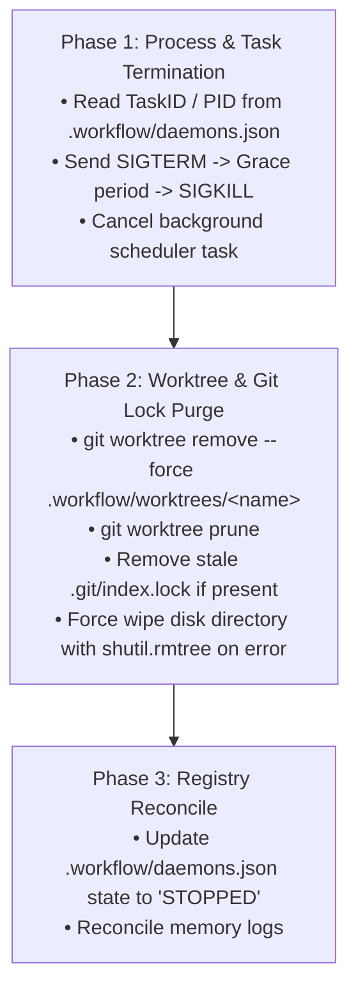

# Technical Architecture & Reference Guide: `workflow`

This document serves as an in-depth reference for the internal architecture, state machine, `.workflow/` module encapsulation, Anti-Zombie lifecycle engine, and Universal Subagent Dispatch protocol of the **`workflow`** skill.

---

## 1. Encapsulated `.workflow/` Module Architecture

All artifacts generated by the workflow suite reside inside the target project's `.workflow/` directory:

```text
<target-project>/
├── src/                                # Application code
├── tests/                              # Application test suites
├── package.json                        # Manifest
│
└── .workflow/                          # 📦 [CENTRALIZED WORKFLOW MODULE]
    ├── workflow.json                   # Workflow configuration
    ├── daemons.json                    # Active daemon registry & health metrics
    ├── PR_SUMMARY.md                   # Auto-generated release PR rollups (Curator)
    │
    ├── specs/                          # Specification catalog
    │   ├── features/                   # [FEATS] New feature specifications (implement)
    │   │   └── 001-payment-gateway/
    │   │       ├── spec.md
    │   │       ├── state.json
    │   │       └── issues/
    │   ├── bugs/                       # [FIXES] BugFix & diagnostic specs (fix)
    │   ├── refactor/                   # [REFACTOR] Code health specs (refactor)
    │   ├── docs/                       # [DOCS] Documentation sync specs (doc_sync)
    │   └── archive/                    # [ARCHIVE] Completed & merged specs (by year)
    │       └── 2026/
    │
    ├── memory/                         # Observable Git-trackable Memory
    │   ├── 00_project_context.md       # Master project context & tech invariants
    │   ├── fix/                        # Episodic memory for fix archetype (01..10)
    │   ├── refactor/                   # Episodic memory for refactor archetype (01..10)
    │   ├── implement/                  # Episodic memory for implement archetype (01..10)
    │   └── doc_sync/                   # Episodic memory for doc_sync archetype (01..10)
    │
    └── worktrees/                      # Physical Git Worktrees (Ignored in .gitignore)
        ├── auto-fixer/
        ├── refactor-worker/
        └── curator/
```

---

## 2. Complete 8-Step Spec-Driven Development & Release Lifecycle

```text
[1. /workflow chat]        ──► Macro architectural brainstorming & idea exploration
       │
       ▼
[2. /workflow new]         ──► Scaffolds .workflow/specs/features/<name>/ (defaults to feat)
       │
       ▼
[3. /workflow specify]     ──► Socratic debate & spec.md co-authoring (GitHub Spec-Kit style)
       │
       ▼
[4. /workflow plan]        ──► Decomposes spec into atomic TDD tasks in issues/*.md
       │
       ▼
[5. /workflow check]       ──► Pre-Execution Quality Gate (evaluates acceptance criteria & edge cases)
       │
       ▼
[6. /workflow run]         ──► Deterministic LangGraph TDD engine (RED -> GREEN -> REFACTOR)
       │
       ▼
[7. /workflow archive]     ──► Moves completed spec to .workflow/specs/archive/<year>/
       │
       ▼
[8. /workflow curate]      ──► Curator Subagent aggregates all decisions and opens Release PR
```

---

## 3. Self-Healing Anti-Zombie Protocol

Whenever `/workflow daemon stop`, `/workflow daemon clean`, or `daemon start` is executed, the engine runs a **3-phase deep cleanup**:



---

## 4. Universal Subagent Dispatch Protocol

To guarantee compatibility across **Antigravity, Claude Code, Cursor, Codex, and Headless Terminals**, the orchestrator outputs a structured `SUBAGENT_DISPATCH_DIRECTIVE`:

```json
{
  "action": "INVOKE_SUBAGENT",
  "role": "Auto-Fixer Specialist",
  "working_directory": ".workflow/worktrees/auto-fixer",
  "system_prompt_file": "skills/workflow/references/prompts/fix.prompt.md",
  "schedule": {
    "type": "recurring_cron",
    "cron_expression": "*/10 * * * *",
    "interval_minutes": 10
  },
  "task_prompt": "Execute background TDD cycle inside isolated worktree..."
}
```

---

## 5. The Release Curator (`curator`)

The **Curator Subagent** acts as the automated release engineer:
- Reads all accumulated decision logs across `.workflow/memory/{fix,refactor,implement,doc_sync}/`.
- Runs full test suite validation in `.workflow/worktrees/curator/`.
- Generates `.workflow/PR_SUMMARY.md` with executive metrics, bug fix tables, and architectural improvements.
- Opens GitHub PRs via `gh pr create` or creates a staging release branch.
